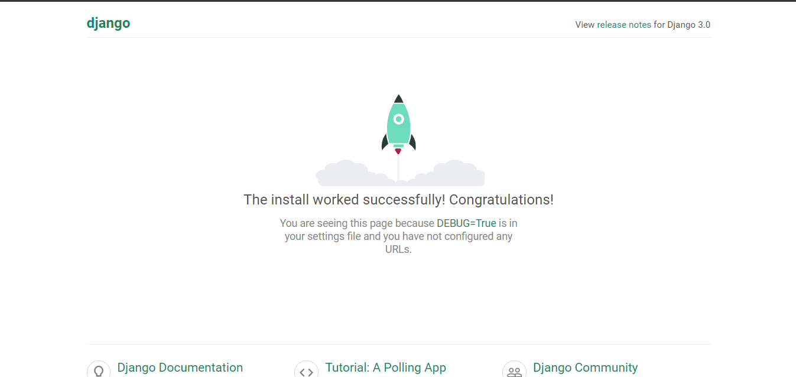

# Weather_app

first of all, creating the project using

// django-admin startproject weather

change directory to weather
create new app using:

//py manage.py startapp weatherapp

add weatherapp in setting.py file under installed apps

migrate in database using:

//py manage.py migrate

create superuser using:

//py manage.py createsuperuser

run server to make sure app is working properly using:

py manage.py runserver

